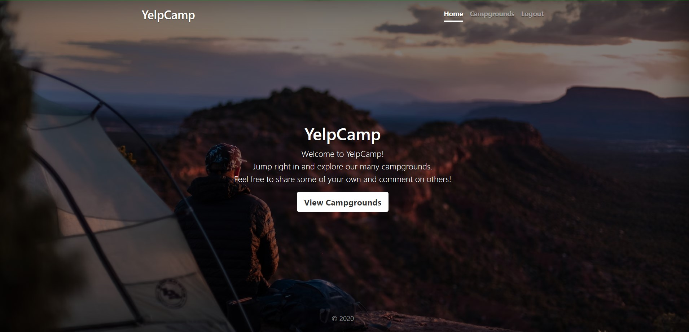

# YelpCamp

YelpCamp is a full-stack web application for exploring and booking campgrounds. It allows users to discover new camping destinations, share their experiences, and connect with fellow outdoor enthusiasts.

## Features

- **User Authentication:** Users can register an account and securely log in to access personalized features.
- **CRUD Operations:** Create, read, update, and delete campground listings to manage camping destinations.
- **Interactive Maps:** View campgrounds on interactive maps powered by Mapbox for easy exploration.
- **Image Storage:** Cloudinary is used to securely store and manage images associated with campground listings.
- **Secure Database:** Campground data is stored in MongoDB Atlas, ensuring data integrity and reliability.
- **CI/CD Pipeline:** Continuous integration and deployment are achieved using Jenkins for CI and ArgoCD for CD, ensuring efficient and automated deployment to Kubernetes.
- **Containerization:** Docker containers are utilized to package the application for easy deployment and scalability.
- **Security Scanning:** Trivy is integrated for filesystem and Docker image scanning, enhancing application security.
- **Code Analysis:** SonarQube is used for code analysis to maintain code quality and identify potential vulnerabilities.

## Tech Stack

- **Frontend:** HTML, CSS, JavaScript
- **Backend:** Node.js
- **Database:** MongoDB
- **Cloud Services:** MongoDB Atlas, Cloudinary, Mapbox
- **CI/CD:** Jenkins, ArgoCD
- **Containerization:** Docker
- **Infrastructure:** Kubernetes (AWS EKS)
- **Security:** Trivy, SonarQube

## Getting Started

1. Clone the repository:

   ```bash
   git clone https://github.com/hemanthreddy00992/yelpCamp-3Tier.git

2. ## Setup Instructions

To get this application up and running, you'll need to set up accounts with Cloudinary, Mapbox, and MongoDB Atlas. Once these are set up, create a `.env` file in the same folder as `app.js`. This file should contain the following configurations:

```sh
CLOUDINARY_CLOUD_NAME=[Your Cloudinary Cloud Name]
CLOUDINARY_KEY=[Your Cloudinary Key]
CLOUDINARY_SECRET=[Your Cloudinary Secret]
MAPBOX_TOKEN=[Your Mapbox Token]
DB_URL=[Your MongoDB Atlas Connection URL]
SECRET=[Your Chosen Secret Key] # This can be any value you prefer
```

After configuring the .env file, you can start the project by running:
```sh
docker build -t yelpCamp .
docker run -d -p 3000:3000 yelpCamp:latest
```

## Application Images



## Credits

This project was made possible with the following github 

- **[[Colt](https://github.com/Colt/YelpCamp)](https://github.com/Colt/YelpCamp)** 


  
